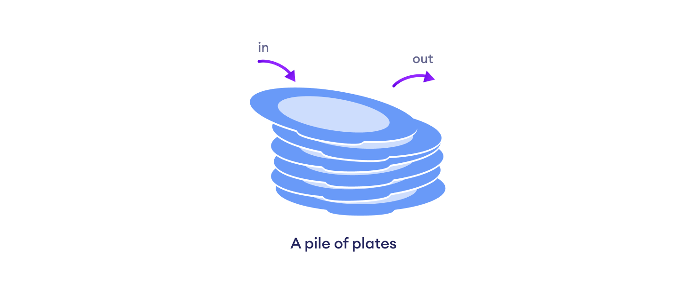

# Data Structures

---

---

-   A data structure is a particular way of organizing data in the computer so that it can be used effectively.

---

## Types of data structures

---

1. Linear data structure
2. Non linear data structures

---

## Linear data structure

---

-   Elements arranged in a sequence, one after the other.

Types of linear data structures

-   Arrays
-   Stacks
-   Queues
-   Linked lists

---

### Arrays

---

-   Elements arranged in continuos memory.
-   All elements are of the same type.

---

### Stacks

---

#### Applications

---

##### In compilers

---

-   Compilers use stacks to figure out the value of expressions like `2 + 4 / 5 * (7 - 9)`

---

##### In browsers

---

-   The back button saves all URL's we've visited in a stack.

---

---

-   The last element that gets into the stack is removed first (**LIFO Principle**: Last in first out)

---

#### Terminologies

---

##### Push

---

-   To put the element inside the stack.

---

##### Pop

---

-   To remove an element from the stack. (Which is the last, recently inserted element)

---

##### Top

---

-   A variable to store the index value of the topmost element.

---

### Queues

---

---

-   Works on the principle of first in first out (**FIFO**)
-   So the first element that gets inside also becomes the first element to leave the queue.

---

#### Terminologies

---

##### Enqueue

---

- To insert an element inside the queue

---

##### Dequeue

---

- To pop out an element from the queue.

---

##### Front

---

- Index to the front element of the queue.

---

##### Rear

---

- Index to the last element of the queue.

---

#### Applications

---

##### Call centers

---

- To hold people calling them in order, until a service representative is free.

---

---

##### CPU task processing

---

- Serving request on a single shared resource like printer, CPU task scheduling.

---

---

### Linked list

---

- Elements not stored in contiguous memory locations.
- Elements linked using pointers

---

---

Types of linked lists:

1. Singly linked list
2. Circular linked list
3. Doubly linked list

---

#### Advantages (over arrays)

---

1. Size of array is generally fixed. In order to store elements without knowing the total elements that'll come in the array, just store them in a linked list.
2. Insertion of elements in array is quite expensive. Because elements are stored in a contiguous block of memory, hence inserting a new element requires all the elements after that index to get shifted, which is becomes quite a big and inefficient job for insertion.

---

#### Disadvantages

---

- Random access not allowed: We need to access the elements sequentially. Accessing any element, randomly is not possible. Hence binary search is also not possible in this case.
- Extra memory space is required along with the element values in order to store the address to the next element.

---

**Note**: Singly linked list is same as the simple linked list we've leant above.

---

#### Circular linked list

---

- Same as the singly linked list with an additional property that the first element's prev. element pointer now points to the last node except for NULL, and the last element's next element pointer now points to the first node.

---

#### Doubly linked list

---

---

- First element

---

---

- General elements

---

---

- Last element

---

---

- Visual representation of 3 element linked list

---

---

##### Advantages

---

- A DLL (Doubly Linked List) can be traversed in both the ways.
- Deletion is quite efficient if the pointer to the element that needs to get deleted is given.
- Insertion is also quite efficiently done.

---

##### Disadvantages

---

- Require more memory than linked list because every element now stores the address of next, as well as previous element.

---
