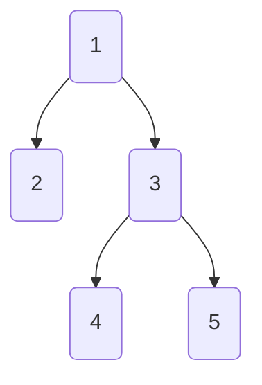

# BFS Algorithm

---

1. Read 1, so the our queue becomes `1`
2. Now, visit the adjacent nodes to 1, so queue becomes `1, 2, 3`
3. Now, after 1 has been visited, move to next element of queue ie 2
4. now put all adjacent nodes of 2 into the queue, so queue becomes `1, 2, 3`
5. Now do similarly

---

# My program

---

- Let a node have following attributes: rightNode, data, leftNode, visited.
- Visited will stores a boolean value. True if it has been visited, else false.
- Then I've made a function namely unitTraversalProcess, which does the following things
1. print current elements data value
2. Make current elements visited = true
3. Added left and right pointer to the queue
- Then I made a while loop which will keep running until all the elements inside the queue has visited = true.
- This ensured that all the elements are getting processed by unitTraversalProcess until they are marked visited.